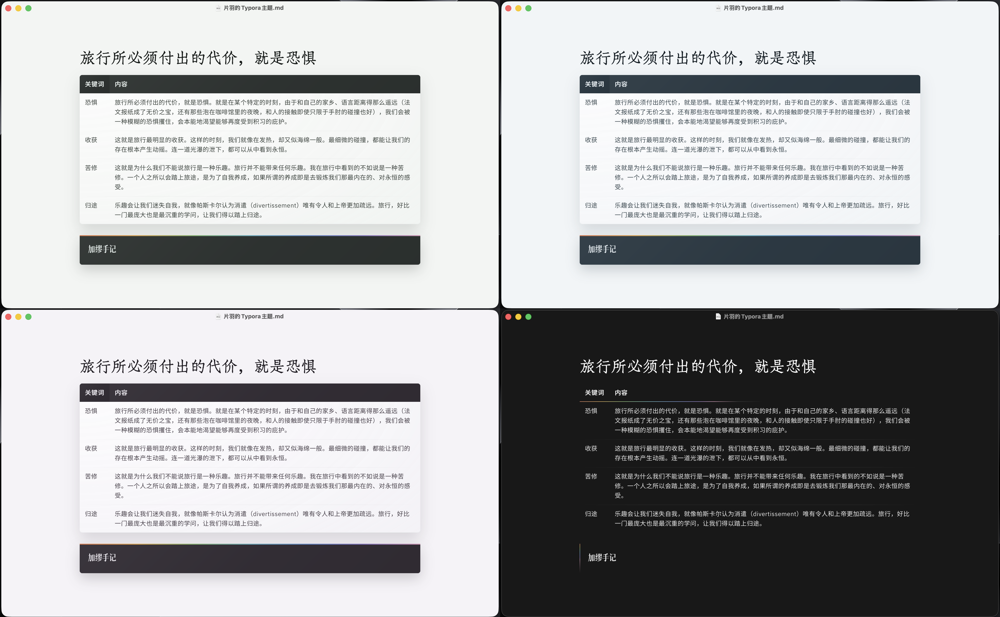

# 片羽 Typora 主题

一套面向长文写作、文字整理和持续创作的中西文 Markdown 排版主题。

## 包含主题

- 青瓷灰：清冷、克制，适合长文与日常写作
- 烟岚紫：安静、柔和，适合随笔与叙事
- 雨霁蓝：清透、理性，适合研究与结构化文档
- 本色：深色模式，适合专注写作

## 下载与安装

完整主题包（包含四个主题、字体、共用样式和许可证）请前往 [Release](https://github.com/Ycyu77/pianyu-typora-themes/releases) 下载。

下载后解压，再按照压缩包内的安装说明操作。完整设计说明见 [`片羽Typora主题展示与设计说明.md`](片羽Typora主题展示与设计说明.md)。
